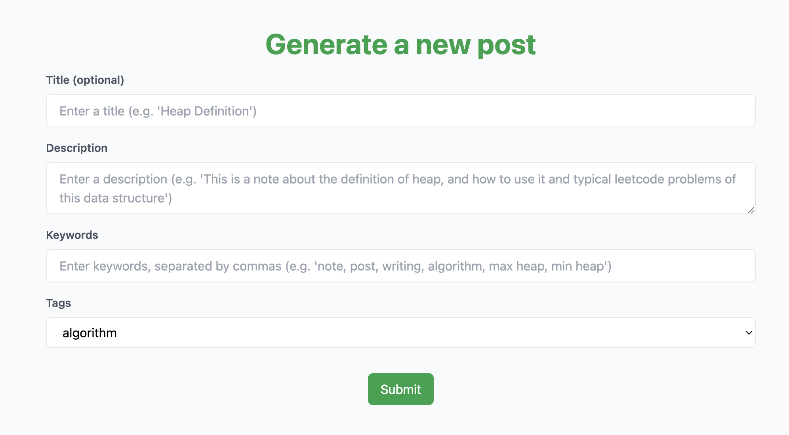

# InstantNote
InstantNote is an AI-powered web app where you can generate tech related notes by only one click. This app is ideal for anyone studying programming and development, providing quick and useful notes to enhance your learning experience.

## Table of Contents
- [Features](#features)
- [Installation](#installation)
- [Usage](#usage)
- [Improvement in the future](#improvement)

## Features
### 1. **Instant Note Generation**
InstantNote uses OpenAI API to generate comprehensive tech-related notes instantly. This feature solves the problem of time-consuming manual note-taking by providing relevant notes with just one-click.

The following code snippet demonstrates how InstantNote uses the OpenAI API to create a detailed note based on user input:

#### **Implementation**

`src/app/api/posts/generatePost/route.ts`

```javascript
// Generate the note content using the OpenAI API
      const generatePost = await openai.chat.completions.create({
        model: "gpt-3.5-turbo",
        messages: [
          {
            role: "system",
            content: "You are a good blog post writer.",
          },
          {
            role: "user",
            content: `Write me a long and logical note about ${description}.
                The title of the note is as follows: ${titleResponse}. These are the keywords
                for the note: ${keywords}. The note should be long and SEO friendly. The
                tag of the note should be ${tag}. Write it as well as you ca. Do not include the 
                title in the post. Divide the note into paragraphs and you can use bullet points
                . Write at least 3 paragraphs. Distinguish the paragraphs with a line break.
                Do not use too formal words, write it like students long notes and make the note memorable.`,
          },
        ],
        temperature: 0.2,
      });
```


### 2. **View / Delete / Copy the Generated Posts**
InstantNote enables you to manage your generated posts efficiently. Here’s how you can interact with your posts:

- View: Each generated post is displayed with its title and content. The content can be presented as a single block of text or broken into multiple paragraphs.

- Delete: Easily remove posts by clicking the "Delete" button. This action triggers a function to delete the post from your list and update the state accordingly.

- Copy to Clipboard: Quickly copy the post’s title and content to your clipboard by clicking the "Copy" button. This functionality is designed to facilitate easy sharing and saving of your notes.

#### **Implementation**

`src/components/items/Post.tsx`

The Post component is responsible for rendering a single post. It receives post and handleDeletePost as props and provides functionality for copying the post content to the clipboard and deleting the post.

`src/app/posts/page.tsx`

The Page component is responsible for fetching and displaying a list of posts. It manages the state for loading posts, the list of fetched posts, and handles the deletion of posts.

`src/app/api/posts/getPosts` & `src/app/api/posts/deletePost`

getPosts API and deletePost API


## Installation
1. **Clone the repository:**
    ```sh
    git clone https://github.com/yourusername/yourproject.git
    ```
2. **Navigate to the project directory:**
    ```sh
    cd yourproject
    ```
3. **Install dependencies:**
    ```sh
    npm install
    ```
4. **Set up environment variables:**
    - Create a `.env` file and add the necessary variables.
    - Example:
        ```env
        DATABASE_URL=your_database_url
        API_KEY=your_api_key
        ```
    - You need to create your own OpenAI API Key, see instructions here: https://platform.openai.com/docs/overview
    - You also need to create a Auth0 account, more information here: https://auth0.com/
    - Stripe API: https://dashboard.stripe.com/login

## Usage
1. **Run the project:**
    ```sh
    npm run dev
    ```

2. **Open your browser and navigate to:**
    ```
    http://localhost:3000
    ```


